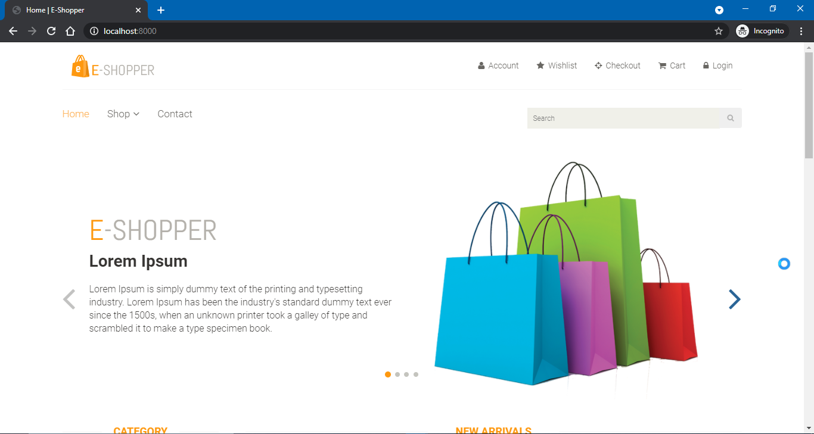
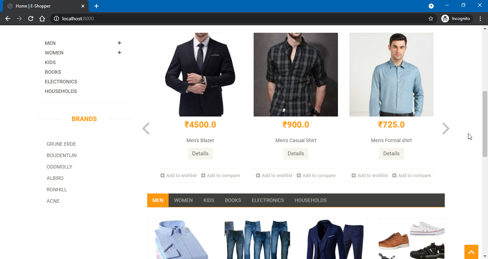
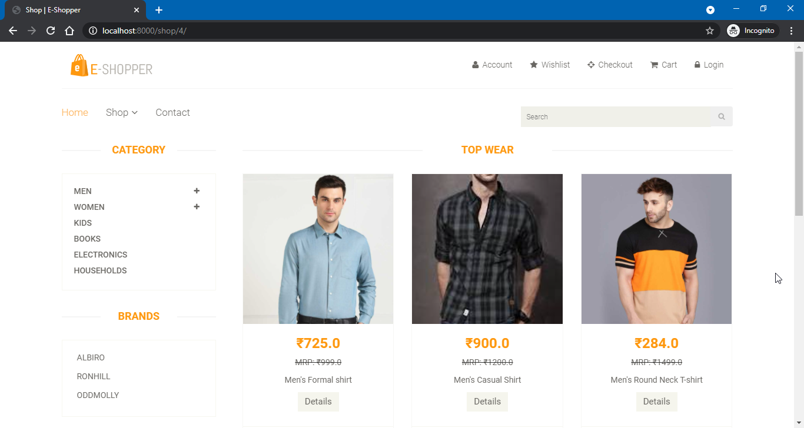
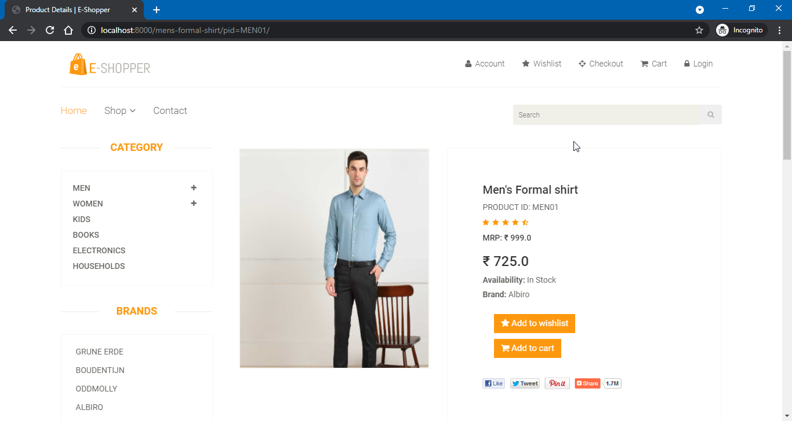
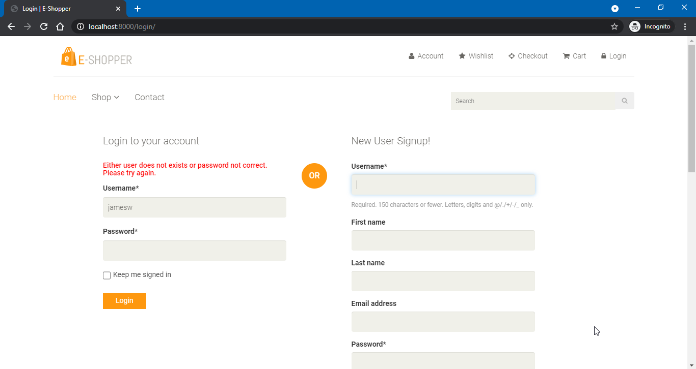
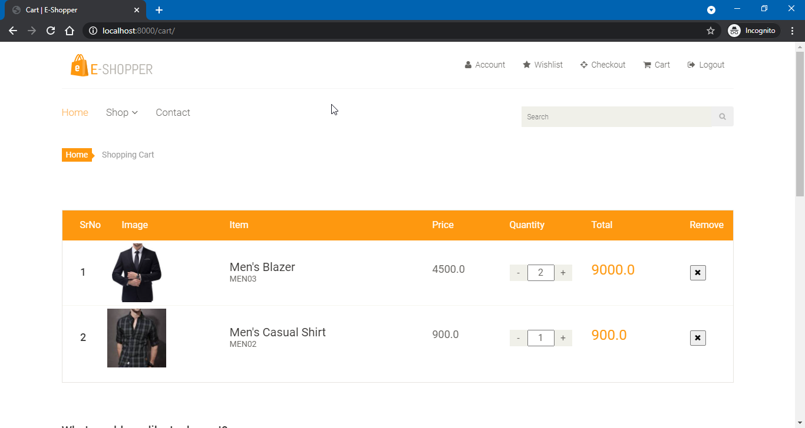

<h1>Ecommerce - Online Cloth Store</h1>

It is an Ecommerce web application made using Django and bootstrap

<h3>Screenshots</h3>
<h6>Home Page</h6>

<h6>Shopping Page</h6>

<h6>Product Detail Page</h6>

<h6>Signup Page</h6>

<h6>Cart Page</h6>

